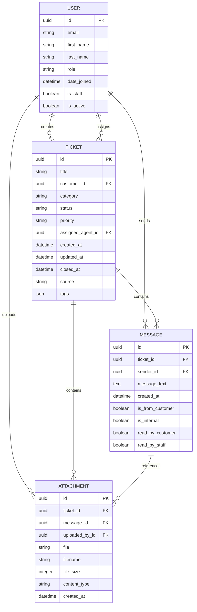
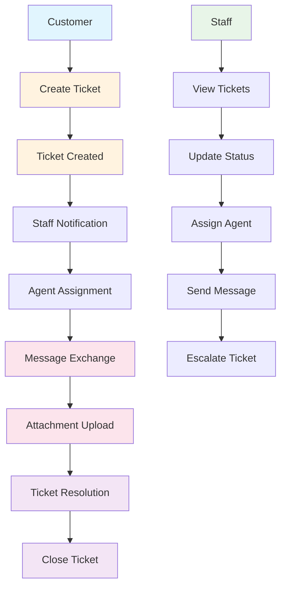

# Support Ticket System - Database Schema

This document provides a visual representation of the database schema for the Support Ticket System, including entity relationships and field details.

## Entity Relationship Diagram

## Detailed Entity Descriptions

### USER Entity

The User entity represents both customers and staff members in the system. It's the existing User model from the accounts app.

**Fields:**

- `id` (UUID) - Primary key
- `email` (String) - User's email address
- `first_name` (String) - User's first name
- `last_name` (String) - User's last name
- `role` (String) - User role (customer, provider, admin)
- `date_joined` (DateTime) - Account creation timestamp
- `is_staff` (Boolean) - Whether user has staff privileges
- `is_active` (Boolean) - Whether account is active

**Relationships:**

- Creates tickets (one-to-many)
- Assigned to tickets (one-to-many)
- Sends messages (one-to-many)
- Uploads attachments (one-to-many)

### TICKET Entity

The Ticket entity represents a support request from a customer.

**Fields:**

- `id` (UUID) - Primary key
- `title` (String, 255 chars) - Brief description of the issue
- `customer_id` (UUID, FK) - Reference to User who created ticket
- `category` (String) - Type of issue (billing, technical, account, service, general)
- `status` (String) - Current state (open, in_progress, resolved, closed)
- `priority` (String) - Importance level (low, medium, high, urgent)
- `assigned_agent_id` (UUID, FK, nullable) - Reference to User assigned to ticket
- `created_at` (DateTime) - Ticket creation timestamp
- `updated_at` (DateTime) - Last update timestamp
- `closed_at` (DateTime, nullable) - Ticket closure timestamp
- `source` (String) - How ticket was created (web, mobile, email, phone)
- `tags` (JSON) - Tags for organization and filtering

**Relationships:**

- Belongs to one customer (many-to-one)
- Can be assigned to one agent (many-to-one)
- Contains many messages (one-to-many)
- Contains many attachments (one-to-many)

### MESSAGE Entity

The Message entity represents communication within a ticket thread.

**Fields:**

- `id` (UUID) - Primary key
- `ticket_id` (UUID, FK) - Reference to parent Ticket
- `sender_id` (UUID, FK) - Reference to User who sent message
- `message_text` (Text) - Content of the message
- `created_at` (DateTime) - Message creation timestamp
- `is_from_customer` (Boolean) - Whether message is from customer
- `is_internal` (Boolean) - Whether message is internal staff note
- `read_by_customer` (Boolean) - Whether customer has read message
- `read_by_staff` (Boolean) - Whether staff has read message

**Relationships:**

- Belongs to one ticket (many-to-one)
- Sent by one user (many-to-one)
- Can have many attachments (one-to-many)

### ATTACHMENT Entity

The Attachment entity represents files uploaded in relation to tickets or messages.

**Fields:**

- `id` (UUID) - Primary key
- `ticket_id` (UUID, FK) - Reference to parent Ticket
- `message_id` (UUID, FK, nullable) - Reference to parent Message (optional)
- `uploaded_by_id` (UUID, FK) - Reference to User who uploaded file
- `file` (FileField) - File data storage reference
- `filename` (String, 255 chars) - Original filename
- `file_size` (Integer) - Size in bytes
- `content_type` (String, 100 chars) - MIME type
- `created_at` (DateTime) - Upload timestamp

**Relationships:**

- Belongs to one ticket (many-to-one)
- Optionally belongs to one message (many-to-one)
- Uploaded by one user (many-to-one)

## Indexes

### TICKET Indexes

1. `idx_ticket_customer` - Index on `customer_id` for customer ticket queries
2. `idx_ticket_status` - Index on `status` for filtering
3. `idx_ticket_priority` - Index on `priority` for sorting
4. `idx_ticket_updated` - Index on `updated_at` for recent activity
5. `idx_ticket_category` - Index on `category` for categorization

### MESSAGE Indexes

1. `idx_message_ticket` - Index on `ticket_id` for message threads
2. `idx_message_created` - Index on `created_at` for ordering
3. `idx_message_customer` - Index on `is_from_customer` for filtering

### ATTACHMENT Indexes

1. `idx_attachment_ticket` - Index on `ticket_id` for ticket attachments
2. `idx_attachment_message` - Index on `message_id` for message attachments
3. `idx_attachment_created` - Index on `created_at` for recent uploads

## Constraints

### TICKET Constraints

- `customer_id` references USER(`id`) with CASCADE delete
- `assigned_agent_id` references USER(`id`) with SET NULL delete
- `status` limited to: open, in_progress, resolved, closed
- `priority` limited to: low, medium, high, urgent
- `category` limited to: billing, technical, account, service, general
- `source` limited to: web, mobile, email, phone

### MESSAGE Constraints

- `ticket_id` references TICKET(`id`) with CASCADE delete
- `sender_id` references USER(`id`) with CASCADE delete
- `is_from_customer` with check constraint matching sender role

### ATTACHMENT Constraints

- `ticket_id` references TICKET(`id`) with CASCADE delete
- `message_id` references MESSAGE(`id`) with SET NULL delete
- `uploaded_by_id` references USER(`id`) with CASCADE delete
- `content_type` validated against allowed file types
- `file_size` validated against maximum size limit

## Data Flow Diagram

This database schema provides a comprehensive foundation for the support ticket system with proper relationships, constraints, and indexing for optimal performance.
